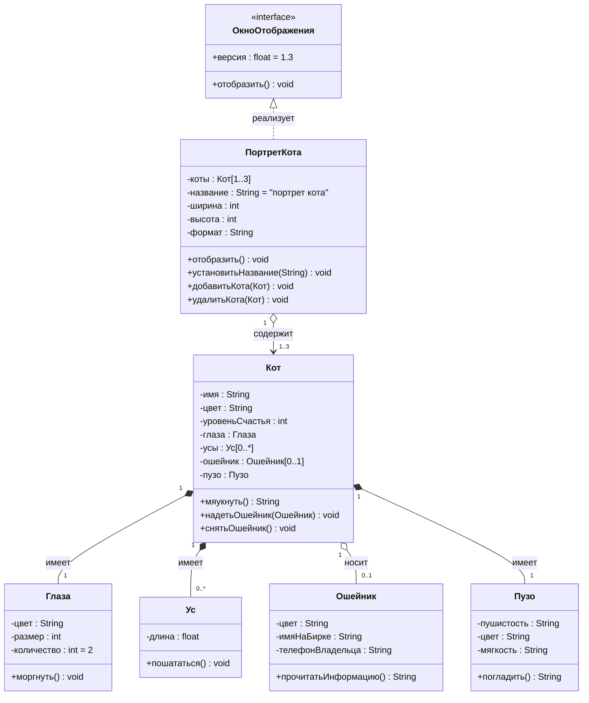

![[Диаграмма классов.png]]
**Цель использования:** Моделирование **статической структуры** системы. Показывает **классы**, их **атрибуты**, **методы** и **отношения** между классами (ассоциация, наследование, агрегация, композиция, зависимость). Это основа для проектирования объектной модели и схемы базы данных.
[Использование диаграммы классов UML при проектировании и документировании программного обеспечения / Хабр](https://habr.com/ru/articles/572234/?ysclid=mk4q6zn3d8458991209#AbstractClass)
Классы и их отношения идентичны [[9 Объектно-ориентированное проектирование]]

**Правила построения:**
    **Класс:** Изображается прямоугольником, разделенным на три секции: имя класса, атрибуты, методы.
    **Видимость:** `+` public, `-` private, `#` protected.
     **Отношения:**
        - **Ассоциация:** Сплошная линия. Может быть именованной, с указанием кратности (1, *, 0..1). Показывает факт связи. Обычно показывает, что один класс использует функционал другого
        ![[Диаграмма классов - ассоциация.png]]
        - **Наследование (Обобщение):** Сплошная линия с пустой стрелкой от потомка к родителю.
        - ![[Диаграмма классов - Наследование.png]]
        - **Агрегация:** Сплошная линия с пустым ромбом со стороны целого (часть может существовать без целого). Показывает, что один класс включает в себя другой как составную часть. При этом, класс-часть может существовать и обособлено
        ![[Диаграмма классов - агрегация.png]]
        - **Композиция:** Сплошная линия с закрашенным ромбом со стороны целого (часть не может существовать без целого, жизненный цикл совпадает). Это как агрегация, но класс-часть не может существовать обособлено
        ![[Диаграмма классов - композиция.png]]
        - **Зависимость:** Пунктирная линия со стрелкой (использование в параметре метода, локальной переменной). Показывает, что изменение одного класса требуют изменений другого. К примеру, изменение математического выражения изменит вид отображаемого графика

![[Виды отношений в диаграмме классов.png]]

