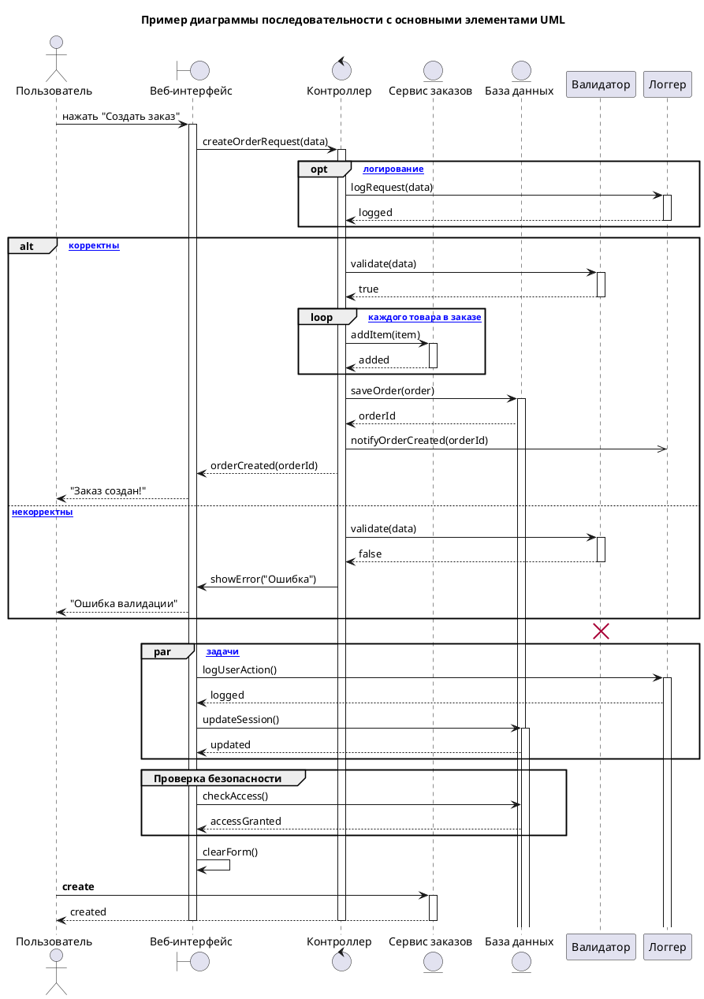

**Цель использования:** Моделирование **динамического поведения** системы во времени. Показывает **последовательность сообщений (вызовов методов)**, которыми обмениваются **объекты (или акторы)** для выполнения конкретного сценария или операции. Используется для проектирования логики взаимодействия.

![[Диаграмма последовательности - пример.png]]
[Диаграмма последовательности (sequence-диаграмма) / Хабр](https://habr.com/ru/articles/814769/?ysclid=mk7gmhixl3983712361)
[Проектирование Sequence-диаграмм: руководство для системных аналитиков / Хабр](https://habr.com/ru/articles/924396/?ysclid=mk88rqka3b491162295)
[Фреймы | System Analyst | Knowledge base](https://docs.system-analyst-base.ru/hard-skills/proektirovanie/notacii-i-diagrammy/uml/diagramma-posledovatelnosti/freimy)
**Правила построения:**
- **Объекты (Участники):** Изображаются прямоугольниками с подписью вверху. Линия жизни – пунктирная вертикаль.
	- **Акторы**
		представляют внешние сущности, взаимодействующие с системой, например, пользователей или другие системы. Они инициируют запросы и получают ответы от системы.
	- **Границы**
		определяют точки взаимодействия системы с внешним миром, например, пользовательский интерфейс или API.
	- **Контроллеры**
		управляют потоком данных и логикой системы, обрабатывая запросы от акторов и направляя их к соответствующим сущностям.
	- **Сущности**
		представляют данные и состояние системы, часто реализованные в виде баз данных или других хранилищ данных.
![[Диаграмма последовательности - Участники.png]]
- **Линия жизни**. Вертикальная пунктирная линия, отображающая существование и участие объекта во взаимодействии. Она начинается с создания объекта и заканчивается его удалением или завершением взаимодействия. На линии жизни могут быть указаны активности, состояния и временные метки для уточнения последовательности событий.
- **Фокус управления (Activation Bar):** Прямоугольник на линии жизни, показывающий период активности объекта.
- **Сообщения:**
	Взаимодействия между объектами отображаются сообщениями (стрелками), которые могут передавать данные и информацию о состоянии объекта.
    - **Синхронное:** Сплошная линия со сплошной стрелкой. Ожидается ответ. Например, вызов функции, который блокирует выполнение до получения результата.
    - **Асинхронное:** Сплошная линия с открытой стрелкой. Ответ не ожидается. Например, отправка сообщения в очередь или запрос, обработка которого происходит в фоновом режиме.
    - **Ответ (Return):** Пунктирная линия с открытой стрелкой. Пунктирная стрелка с незакрашенным наконечником, идущая от получателя к отправителю, отображающая возвращаемое значение функции или метода.
![[Диаграмма последовательности - стрелки.png]]

- **Активация**. Прямоугольники на линиях жизни, отражающие период активности объекта. Они указывают на то, когда объект выполняет некоторую операцию или метод.
- **Фрейм** - Специальные блоки, позволяющие структурировать сложные взаимодействия, такие как циклы, альтернативные варианты выполнения или параллельные процессы. Ограничиваются **рамкой взаимодействия (combined fragment)** с меткой (`opt` – если, `loop` – цикл, `alt` – альтернатива).
	- **Alt**
		(условное выполнение) - обозначает ветвление логики в зависимости от условия. Содержит два или более фрагмента, один из которых выполняется в зависимости от результата проверки условия.
	- **Opt**
		(опциональное выполнение) - обозначает блок, который может быть выполнен или пропущен в зависимости от условия.
	- **Par**
		(параллельное выполнение) - обозначает параллельное выполнение нескольких блоков.
	- **Loop**
		(цикл) - обозначает повторяющийся блок действий. Включает условие выхода из цикла.
	- **Ref**
		обозначает ссылку на другую диаграмму последовательности. Используется для упрощения сложных диаграмм путем разбиения их на более мелкие, более управляемые части. Это позволяет избежать излишнего усложнения основной диаграммы.
	- **Neg**
		обозначает альтернативный сценарий, который не должен выполняться. Обычно используется для моделирования ошибок или исключительных ситуаций.
![[Диаграмма последовательности - пример фреймов.png]]

- **Уничтожение объекта**. Элемент обозначающий конец его линии жизни в этом взаимодействии – момент, когда объект перестает иметь значение в последовательности.
![[Диаграмма последовательности - Уничтожение объекта.png]]

